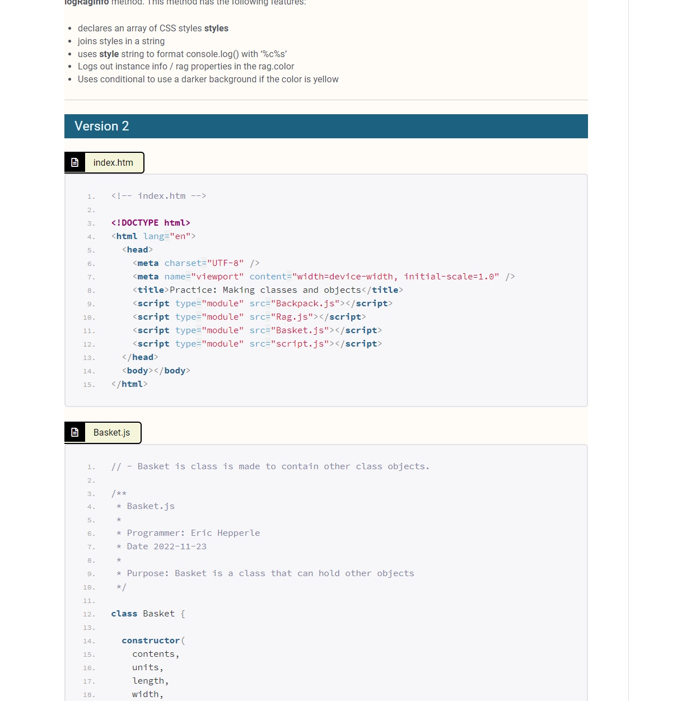

Eric Hepperle
2022-12-02
---

README:

Cloned from origial from 2022-11-21

This version will focus on setting up an "assembly line" template to help automate the creation of well formatted, semantic blog posts for course notes posts.

---

# SOP:

Here is my tentative plan for auto-generating the correct blog post.

## Overview

1. Keep different sections in different PHP includes files
2. Use the actual CSS from the theme
3. Keep code snippets in their own files (numbered according to chapters)

## Steps

- Export file from md as html
- Remove all classes from HTML (in browser?)

---

TOOLS:

- https://github.com/codewizard13/ehw-app-scrape-course-tuts